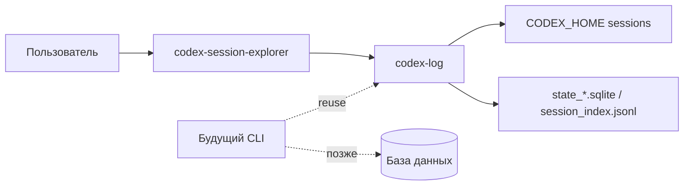
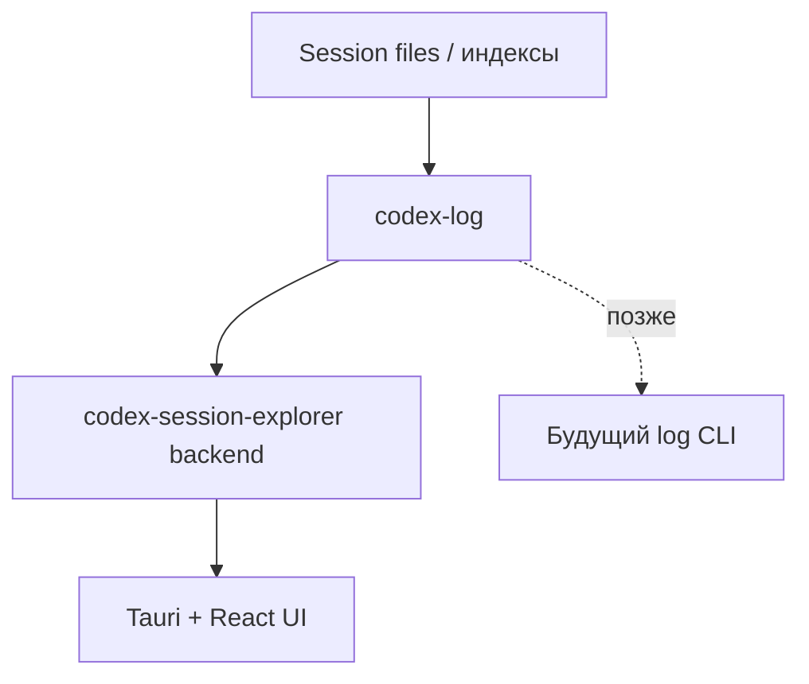

# Архитектурная документация (arc42)

**Проект:** `codex-session-view`  
**Версия:** 0.2-draft  
**Дата:** 2026-04-16  
**Статус:** Черновик

## 1. Введение и цели

`codex-session-view` это монорепозиторий для чтения и просмотра логов Codex-сессий. В нём нет orchestration runtime, root package/bin и task-runner сценариев. В поддерживаемом scope остаются:

- `crates/codex-log` как каноническое Rust-ядро для session discovery, нормализации, replay и projection;
- `apps/codex-session-explorer` как desktop-приложение для интерактивного анализа логов.

Следующий этап заранее зарезервирован в архитектуре: отдельный CLI для чтения логов и отправки их в базу данных, но без реализации в текущем репозитории.

### 1.1 Цели качества

| Приоритет | Цель | Смысл |
| --- | --- | --- |
| 1 | Единая точка правды по логам | Все правила чтения, нормализации и replay живут в `codex-log`. |
| 2 | Диагностируемость | Viewer и тесты читают один и тот же канонический `EventRecord`. |
| 3 | Эволюционность | Будущий CLI переиспользует `codex-log`, не создавая вторую реализацию ingestion. |

## 2. Ограничения

| Ограничение | Основание |
| --- | --- |
| Проект сфокусирован только на логах | В scope остались только `codex-log`, `codex-session-explorer` и будущий CLI поверх них. |
| Desktop viewer остаётся на Tauri v2 + React | Это уже рабочий пользовательский интерфейс для анализа сессий. |
| Источник данных — файловый `CODEX_HOME` и индексы SQLite/JSONL | Именно эту модель уже поддерживает `codex-log`. |
| Будущий CLI не реализуется сейчас | В архитектуре фиксируется только место для него. |

## 3. Контекст и границы

### 3.1 Внутренние границы

- `codex-log` отвечает за `EventRecord`, readers, session catalog, replay, operation stream и tree/view-model.
- `codex-session-explorer` отвечает за desktop UI и read-only backend-команды.
- Root workspace не содержит собственного runtime и не должен хранить дублирующую event-модель.

## 4. Стратегия решения

- Поддерживать library-first архитектуру, где весь reusable ingestion код живёт в `codex-log`.
- Держать viewer тонким consumer-слоем поверх backend API и канонической логовой модели.
- Фиксировать будущий CLI только на уровне архитектуры и roadmap, пока не определены контракт экспорта и схема БД.

## 5. Строительные блоки

| Компонент | Ответственность |
| --- | --- |
| `crates/codex-log` | Session discovery, нормализация, replay, projector, tree и общие логовые утилиты |
| `apps/codex-session-explorer/src-tauri` | Backend-команды Tauri для списка сессий, preview, load и tail |
| `apps/codex-session-explorer/src` | Пользовательский UI `codex-session-explorer` |

## 6. Runtime-сценарии

### 6.1 Открытие сессии во viewer

1. Пользователь выбирает `CODEX_HOME`.
2. Viewer backend через `codex-log` строит catalog.
3. UI показывает список, preview и timeline сессии.
4. При live tail backend дочитывает только новые записи и возвращает обновлённый cursor.

## 7. Развёртывание

- `codex-log` используется как обычный Rust crate внутри workspace.
- `codex-session-explorer` собирается как Tauri desktop application.
- Внешняя БД пока отсутствует.

## 8. Концепты

- Канонический `EventRecord` остаётся единой внутренней моделью.
- Session discovery поддерживает file-backed и indexed SQLite path.
- Viewer использует read-only IPC и не модифицирует исходные логи.

## 9. Архитектурные решения

- Монорепозиторий поддерживает только `codex-log` и `codex-session-explorer`.
- Будущий CLI будет отдельным компонентом поверх `codex-log`, а не частью viewer.

## 10. Риски

- Дублирование логовой логики вне `codex-log` снова создаст расхождение в нормализации.
- Будущий CLI легко размоет границы проекта, если начнёт тянуть свою event-модель.
- Изменения в event processing требуют синхронного обновления `docs/log-events.md`.
