# Архитектурная документация (arc42)

**Проект:** `codex-worker-rs`  
**Версия:** 0.1-draft  
**Дата:** 2026-04-07  
**Статус:** Черновик

---

## 1. Введение и цели

### 1.1 Обзор требований

`codex-worker-rs` это новая реализация существующего проекта `codex-worker` на Rust. Первая цель проекта: сохранить поведение текущей Python-версии. Следующая цель: подготовить основу для внешнего управления воркерами, общей очереди задач и централизованной наблюдаемости.

Требования `v1`, зафиксированные в [PLAN.md](../../../PLAN.md):

- выполнять `run-next` как последовательный воркер вокруг `codex exec --json`;
- читать задачи из markdown-файла задач со статусами `[ ]`, `[>]`, `[x]`, `[!]`;
- атомарно выполнять захват задачи, heartbeat, финализацию и восстановление stale-задач;
- строить итоговый prompt на основе `prompts/orchestrator.md`, метаданных задачи и тела задачи;
- нормализовать корневые и подчинённые события в единый журнал событий;
- сохранять артефакты запуска для post-mortem;
- завершать задачу по правилам fail-closed при некорректном выводе рантайма;
- показывать живой интерфейс в терминале во время выполнения.

Направление после `v1`, также зафиксированное в [PLAN.md](../../../PLAN.md):

- внешнее управление воркером: `start`, `stop`, `pause`, `resume`, `cancel`;
- внешняя очередь задач вместо единственного локального markdown-источника;
- экспорт логов, событий и телеметрии во внешние приёмники;
- развитие в сторону `control plane` и операторского UI.

Основной источник текущих решений и границ:

- [PLAN.md](../../../PLAN.md)

### 1.2 Цели по качеству

| Приоритет | Цель качества | Сценарий |
|----------|---------------|----------|
| 1 | Поведенческая совместимость | Rust-версия должна обрабатывать те же файлы задач и те же fake-codex сценарии, что и Python-версия, с теми же итоговыми статусами задач. |
| 2 | Операционная безопасность | Два процесса-воркера не должны одновременно захватить одну задачу, а stale-running задачи должны восстанавливаться детерминированно. |
| 3 | Диагностируемость | Любой неуспешный запуск должен оставлять достаточно артефактов (`prompt.md`, `stdout.jsonl`, `stderr.log`, `events.jsonl`, `summary.json`) для post-mortem без повторного запуска. |
| 4 | Эволюционность | Ядро `v1` должно использоваться и после появления внешнего управления, общей очереди и телеметрии без радикальной переделки. |
| 5 | Переносимость окружения | Воркер должен одинаково вести себя на хосте и внутри devcontainer с теми же семантиками задач и артефактов. |

### 1.3 Заинтересованные стороны

| Роль | Ожидания | Опасения |
|------|----------|----------|
| Мейнтейнер / архитектор | Предсказуемая миграция с Python на Rust, явная архитектура, совместимость с будущим `control plane` | Преждевременное усложнение, потеря паритета с текущим воркером |
| Команда разработки | Чёткие модульные границы, тестируемость, понятная модель рантайма | Скрытые зависимости, сложная отладка, размытые контракты |
| Оператор / будущий владелец `control plane` | Безопасное выполнение задач, видимость состояния воркера и запуска, управляемость жизненного цикла | Плохая наблюдаемость, небезопасная остановка, частично записанное состояние |
| Пользователь CLI | Предсказуемое поведение `run-next`, полезные логи, простой запуск | Тихие сбои, сломанные файлы задач, неочевидное восстановление после падений |

---

## 2. Ограничения

### 2.1 Технические ограничения

| Ограничение | Основание / мотивация |
|-------------|-----------------------|
| Новый проект реализуется на Rust | Это основная цель нового репозитория |
| Backend исполнения остаётся `codex exec --json` | Воркер оборачивает существующий Codex CLI, а не заменяет его |
| Файловые артефакты остаются первичным источником истины | Это соответствует текущему дизайну и требованиям post-mortem |
| Жизненный цикл задачи требует атомарных обновлений | Существующее поведение опирается на atomic replace и lock-based координацию |
| Форматы корневых событий и `subagent session` должны оставаться совместимыми с текущим выводом Codex | Поведенческий контракт уже зафиксирован тестами Python-проекта |
| Для `v1` выбирается blocking I/O и потоки, а не async-first подход | Это явно зафиксировано в плане как способ упростить паритет и диагностику |

### 2.2 Организационные ограничения

| Ограничение | Основание / мотивация |
|-------------|-----------------------|
| Миграция должна быть поэтапной, а не big-bang rewrite | Python-проект уже работает и служит эталоном поведения |
| В документации можно фиксировать только известные решения | На текущем этапе часть деталей ещё не реализована и должна помечаться как `TBD` |
| Темы после `v1` не должны размывать границы `v1` | План сознательно отделяет перенос рантайма воркера от будущего `control plane` |
| Каталог ADR пока отсутствует | Решения пока живут в `PLAN.md` и архитектурных заметках |

### 2.3 Соглашения

| Соглашение | Описание |
|------------|----------|
| Язык документации | Вся пояснительная документация проекта пишется по-русски. Английский допустим только для имён файлов, команд, API, форматов, code identifiers и устойчивых технических терминов. |
| Формат документации | Markdown в `docs/`, диаграммы в Mermaid |
| Архитектурный формат | arc42 используется как основное архитектурное описание |
| Фиксация решений | ADR будут добавляться позже; до этого временные решения живут в `PLAN.md` |
| Хранение артефактов | Артефакты запуска сохраняются в файлах и рассматриваются как auditable evidence |
| Подход к тестированию | Rust-реализация подтверждается через поведенческий перенос Python-тестов |

---

## 3. Контекст и границы

### 3.1 Бизнес-контекст

`codex-worker-rs` это исполнительный рантайм для автоматизации задач на базе Codex. В `v1` это локально запускаемый воркер, читающий задачи из markdown-файла задач. После `v1` он должен стать управляемым узлом исполнения внутри более крупной orchestration-системы.

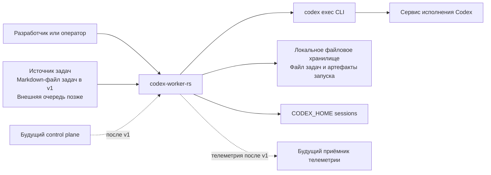

**Партнёры по взаимодействию:**

| Партнёр | Что передаёт в систему | Что получает от системы |
|---------|------------------------|-------------------------|
| Разработчик / оператор | CLI-команду, конфигурацию, путь к файлу задач | Консольный вывод, статус запуска, артефакты |
| Источник задач | Pending-задачи и метаданные | Обновлённое состояние задач и сведения о запуске |
| `codex exec` CLI | JSON-поток событий, `stderr`, код завершения процесса | Prompt через `stdin`, `cwd`, runtime flags |
| `CODEX_HOME` sessions | Файлы подчинённых сессий | Импортированные подчинённые события |
| Локальное файловое хранилище | Уже существующие файлы задач и каталоги артефактов | Обновлённые файлы задач, логи, события, summary |
| Будущий `control plane` | Команды жизненного цикла, назначения задач, конфигурацию | Статус воркера, heartbeat, состояние запуска, телеметрию |

### 3.2 Технический контекст

| Интерфейс | Назначение | Протокол / формат |
|-----------|------------|-------------------|
| Worker CLI | Точка входа для `run-next` и будущих команд управления | Локальный запуск процесса, аргументы CLI |
| Файл задач | Канонический источник задач в `v1` | Markdown с блоком метаданных |
| Поток процесса исполнения | Поток исполнения от `codex exec` | `stdout` в формате JSON lines, `stderr` в текстовом виде |
| Импорт `subagent sessions` | Поздний или live-импорт подчинённых событий | JSONL-файлы в `CODEX_HOME/sessions` |
| Хранилище артефактов | Постоянное хранение результатов запуска | Каталог с текстовыми файлами и JSONL |
| Будущий API управления воркером | Внешние `start`/`stop`/`pause`/`resume` и статус | `TBD`, вероятно локальный HTTP или Unix socket |
| Будущий экспорт телеметрии | Репликация operational signals | `TBD`, вероятно JSONL export, HTTP batch или OTLP |

Границы области ответственности:

- В scope `v1` входят: рантайм воркера, координация задач, сборка prompt, нормализация событий, сохранение артефактов, консольный UI.
- Вне scope `v1`: централизованный scheduler, распределение задач между несколькими воркерами, web UI, устойчивый внешний API, агрегирующий индекс состояния.

---

## 4. Стратегия решения

| Цель качества | Подход | Обоснование |
|---------------|--------|-------------|
| Поведенческая совместимость | Переносить проект модуль за модулем и сохранять ключевые форматы файлов и семантику событий | Это даёт проверяемую миграцию и опору на Python-эталон |
| Операционная безопасность | Использовать lock-файлы, atomic writes, явный lease и stale recovery по heartbeat | Это снижает риск порчи файла задач и двойного захвата |
| Диагностируемость | Всегда сохранять immutable артефакты запуска и структурированный `summary.json` | Это делает post-mortem воспроизводимым и дешёвым |
| Эволюционность | Жёстко разделить ядро рантайма воркера и будущие темы уровня `control plane` | Это позволит добавить внешнее управление и очередь без переписывания ядра исполнения |
| Переносимость окружения | Сохранять filesystem-centric дизайн и не привязывать рантайм к одной топологии | Это упрощает запуск и на хосте, и в devcontainer |

**Ключевые технологические решения:**

- Rust как основной язык реализации.
- Cargo workspace с разделением на orchestration crate, library crate для логов и отдельный desktop viewer.
- Блокирующий subprocess и файловый I/O с использованием потоков в `v1`.
- `serde` и JSONL для сериализации событий и артефактов.
- POSIX-подобная модель file locking и atomic replace для mutable state.
- Терминальный UI и Tauri viewer как отдельные consumer-слои поверх общего `codex-log`.

**Архитектурные паттерны:**

- последовательный рантайм воркера;
- file-based координация состояния;
- разделение mutable task state и immutable артефактов запуска;
- каноническая внутренняя event model с несколькими адаптерами входных данных;
- library-first разделение ingestion/tree слоя от конкретных UI и orchestration consumers;
- постепенная архитектура: локальный воркер сначала, управляемый воркер позже.

---

## 5. Представление строительных блоков

### 5.1 Уровень 1: обзор системы

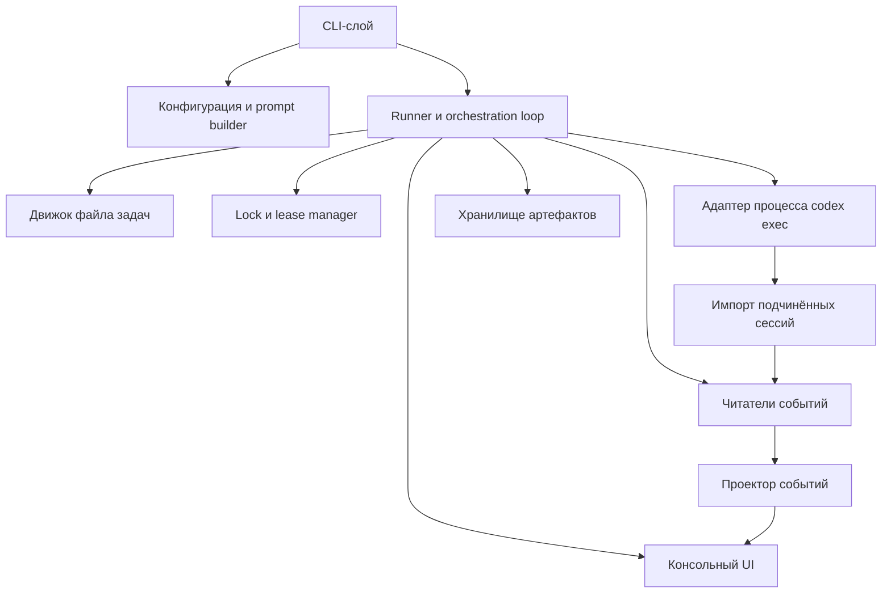

**Компоненты:**

| Компонент | Ответственность | Интерфейсы |
|-----------|-----------------|------------|
| CLI-слой | Разбор команд и опций, создание рантайма воркера | Аргументы CLI |
| Конфигурация и prompt builder | Разрешение путей, template, model/sandbox settings, `default_cwd` | Метаданные задачи, значения конфигурации, prompt template file |
| Движок файла задач | Парсинг markdown-задач, сериализация, claim/finalize, stale recovery | Markdown-файл, in-memory snapshot |
| Lock и lease manager | Эксклюзивный доступ к файлу задач и payload lock-файла | Lock file, file system |
| Runner | Координация claim, prompt build, subprocess run, event ingestion, summary generation | Внутренний runtime API |
| Адаптер процесса `codex exec` | Запуск дочернего процесса и потоковое чтение `stdout`/`stderr` | Локальный процесс, `stdin`/`stdout`/`stderr` |
| Читатели событий | Нормализация корневых runtime-событий и payload из `subagent sessions` | JSON lines, session files |
| Проектор событий | Построение snapshot текущего запуска, дерева агентов и timeline | Канонический поток событий |
| Хранилище артефактов | Запись prompt, logs, events, summary и task snapshots | File system |
| Консольный UI | Отрисовка live-статуса и timeline в терминале | Snapshot проектора событий |

### 5.1.1 Workspace split

Текущая реализация разделена на три роли внутри одного репозитория:

- root package `codex-worker-rs` отвечает за `run-next`, task orchestration, запись run artifacts и
  live sync с subagent sessions;
- `crates/codex-log` содержит source of truth для `EventRecord`, readers, replay, tree/view-model,
  `SessionCatalog`, `SessionLoader`, `SessionReader` и `TailCursor`;
- `apps/codex-log-viewer` это отдельный desktop product на Tauri + React, который читает
  `CODEX_HOME` напрямую через backend-команды и не зависит от run-dir worker.

### 5.2 Уровень 2: внутренняя структура runner

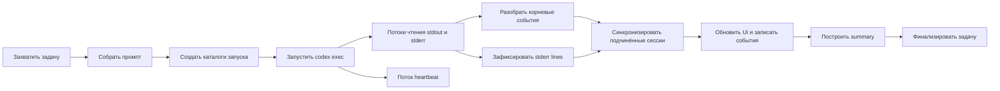

**Подкомпоненты и роли:**

- Стадия claim: загрузка snapshot, stale recovery и атомарный перевод следующей задачи в `running`.
- Стадия исполнения: запуск `codex exec`, передача prompt в `stdin`, параллельное чтение потоков.
- Стадия ingestion: преобразование сырых событий в канонические `EventRecord` через `codex-log`.
- Стадия синхронизации подчинённых сессий: поиск session files через `SessionCatalog` и дозагрузка
  tail-инкрементов через `SessionReader`.
- Стадия финализации: построение `RunSummary`, запись артефактов, обновление файла задач и архивация при необходимости.

### 5.3 Уровень 2: подсистема обработки событий

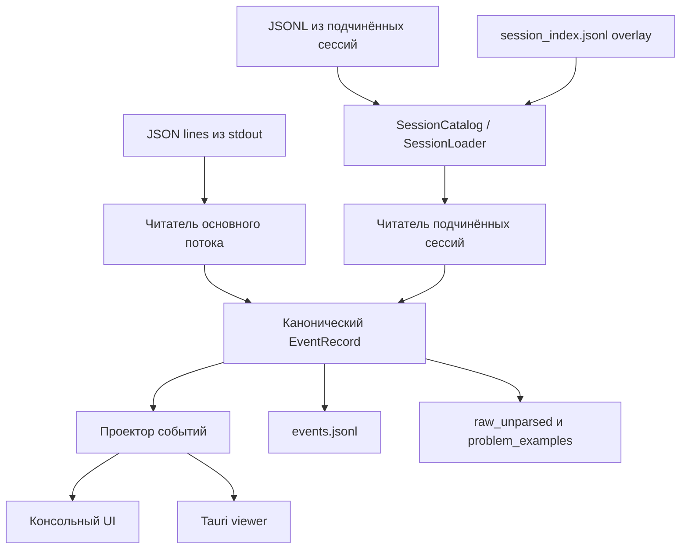

Подсистема событий изолирует дрейф формата внешнего runtime output от остальной системы.
Worker и Tauri viewer работают уже не с сырыми payload, а с общими library-level API:
каталогом сессий, канонической event model и tree/view-model.

---

## 6. Представление времени выполнения

### 6.1 Сценарий 1: успешный `run-next`

**Описание:** Воркер захватывает следующую pending-задачу, запускает `codex exec`, собирает события и переводит задачу в `completed`.

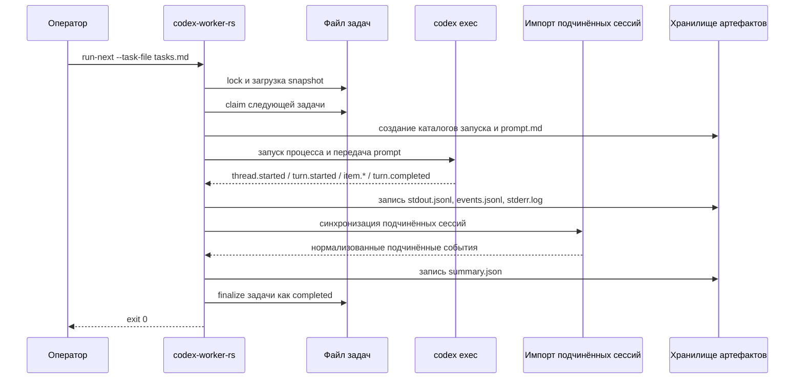

**Шаги:**

1. Оператор запускает `run-next`.
2. Воркер получает эксклюзивный lock на файл задач.
3. Если есть stale-running задачи, они переводятся в failed.
4. Следующая pending-задача переводится в `running` и получает lease metadata.
5. Воркер собирает итоговый prompt и создаёт каталоги запуска.
6. `codex exec --json` начинает выдавать структурированные события.
7. Корневые и подчинённые события нормализуются и сохраняются.
8. После проверки success criteria пишется `summary.json`.
9. Задача финализируется как `completed`; при завершении всех задач файл задач может быть архивирован.

### 6.2 Сценарий 2: fail-closed ошибка рантайма

**Описание:** Воркер получает некорректный или неполный runtime output и обязан безопасно перевести задачу в failed.

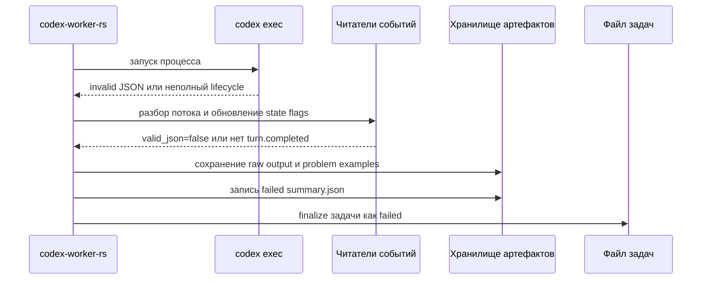

**Fail-closed критерии успеха и неуспеха:**

- `codex exec` завершился неуспешно;
- stdout не является корректным JSON stream;
- отсутствует `thread.started`;
- отсутствует `turn.completed`;
- присутствует `turn.failed`;
- присутствует top-level `error`;
- отсутствует итоговое сообщение агента.

Если выполняется любое из этих условий, запуск не считается успешным.

### 6.3 Сценарий 3: восстановление stale-задачи

**Описание:** Во время следующего запуска воркер обнаруживает, что ранее захваченная задача зависла.

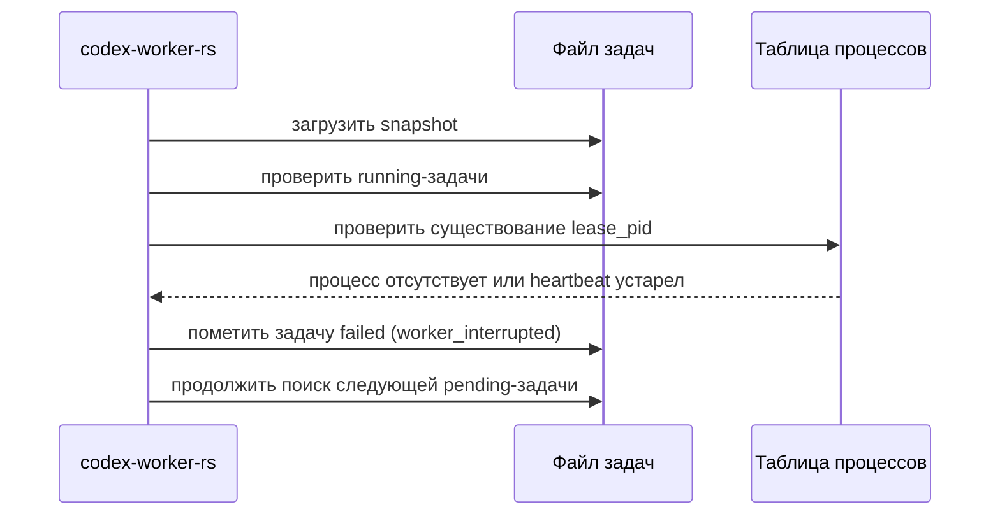

Этот сценарий важен, потому что воркер должен восстанавливаться после падений без ручного редактирования файла задач.

---

## 7. Представление развёртывания

### 7.1 Инфраструктура `v1`

`v1` намеренно остаётся простой: локальный бинарник воркера, существующий Codex CLI и файловое окружение для задач и артефактов.

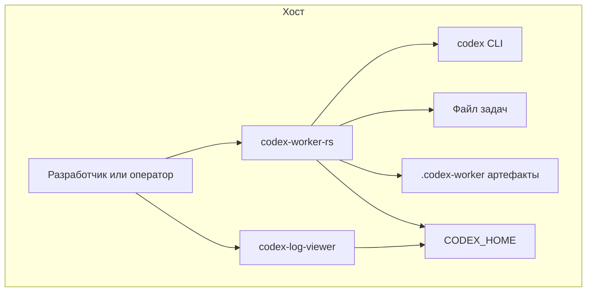

**Узлы:**

| Узел | Назначение | Технология |
|------|------------|------------|
| Терминал разработчика / оператора | Запуск воркера и просмотр результата | Локальная оболочка |
| `codex-worker-rs` | Исполняющий рантайм orchestration | Rust binary |
| `codex-log-viewer` | Read-only desktop viewer для Codex sessions | Tauri + React |
| `codex` CLI | Внешний execution engine | Установленный Codex CLI |
| Файл задач | Изменяемая очередь задач в `v1` | Markdown file |
| Каталог артефактов | История запусков и диагностика | Local filesystem |
| `CODEX_HOME` | Данные сессий и аутентификации | Local filesystem mount |

### 7.2 Поддерживаемые топологии

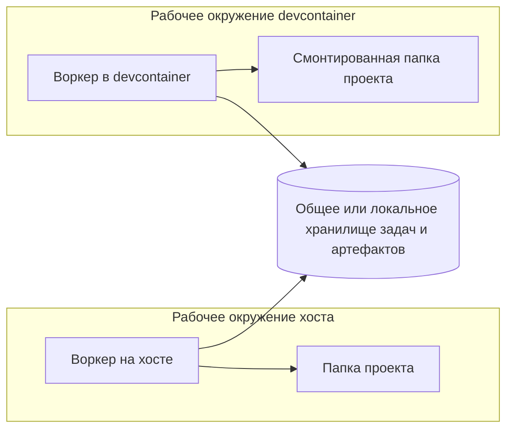

Поддерживаемые и целевые топологии:

- работа только на хосте;
- воркер внутри devcontainer с mounted project workspace;
- будущий гибридный пул из нескольких воркеров с shared storage.

### 7.3 Окружения

| Окружение | Назначение | Конфигурация |
|-----------|------------|--------------|
| Локальная разработка на хосте | Быстрая итерация и отладка | Локальный Rust toolchain, локальный `codex` CLI, локальные файлы задач |
| Локальная разработка в devcontainer | Повторяемое dev/runtime окружение | Rust devcontainer, mounted project folder, mounted `CODEX_HOME` |
| Будущее управляемое окружение | Общий пул воркеров и внешнее управление | `TBD`, post-`v1` control plane и внешняя очередь |

---

## 8. Сквозные концепции

### 8.1 Доменная модель

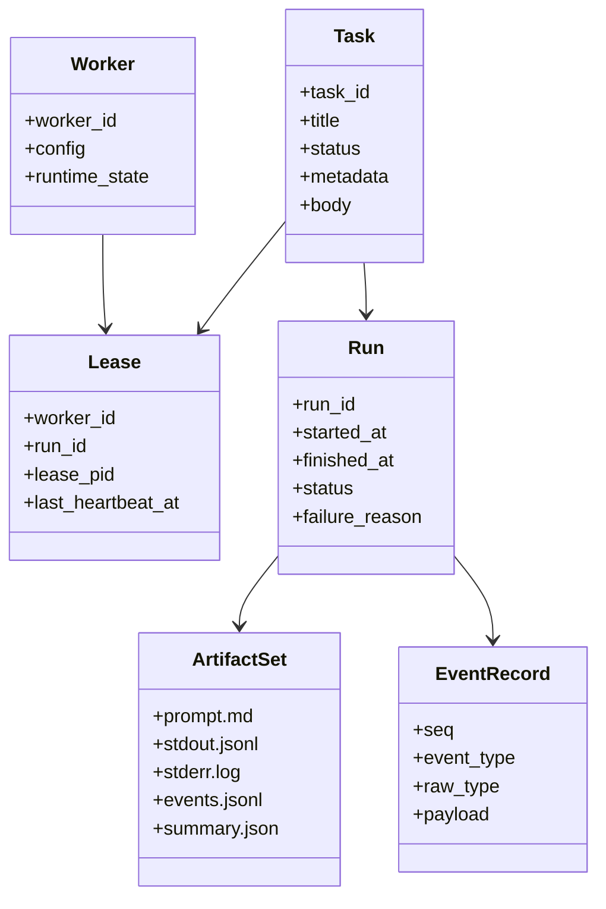

Ключевые сущности:

- `Task` — единица работы из источника задач.
- `Lease` — временное владение задачей конкретным воркером.
- `Run` — одна конкретная попытка исполнения задачи.
- `EventRecord` — каноническое нормализованное событие.
- `ArtifactSet` — набор файлов одного запуска.
- `Worker` — процесс, выполняющий orchestration loop.

### 8.2 Координация и параллелизм

- Только изменения task state сериализуются через lock.
- Один экземпляр `run-next` в `v1` выполняет по одной задаче за раз.
- Дочерний процесс, heartbeat и чтение потоков работают параллельно.
- Импорт `subagent sessions` может быть отложенным, но должен сойтись до построения итогового summary.

### 8.3 Хранение состояния и артефактов

Архитектура сознательно разделяет:

- mutable coordination state: файл задач, lock file, heartbeat metadata;
- immutable run artifacts: prompt, stdout, stderr, events, summary, imported sessions;
- будущие производные индексы: queue indexes, telemetry rollups, UI projections.

Это сохраняет прозрачность системы и позволяет позже добавить `control plane`, не отказываясь от file artifacts.

Для `CODEX_HOME` дополнительно действует split между двумя слоями:

- session files в `CODEX_HOME/sessions/**` это source of truth существования сессии;
- `session_index.jsonl` это только metadata overlay для viewer и runtime discovery.

### 8.4 Наблюдаемость и телеметрия

Наблюдаемость строится из трёх слоёв:

- сырые логи: `stdout` и `stderr` дочернего рантайма;
- канонические события: структурированный журнал событий для корневой и подчинённой активности;
- summary: компактная интерпретация результата запуска.

После `v1` эти же сигналы должны использоваться для:

- телеметрии по жизненному циклу воркера;
- метрик очереди;
- аудита операторских действий;
- внешнего экспорта телеметрии.

### 8.5 Обработка ошибок

Главное архитектурное правило: fail-closed исполнение.

- неполный runtime output никогда не считается успехом;
- connection/runtime classification по возможности фиксируется в summary;
- неразобранные payload не теряются, а сохраняются;
- stale-running задачи помечаются failed явно, а не остаются в неопределённом состоянии.

### 8.6 Тестирование

Предпочтительная стратегия тестирования: поведенческий паритет с Python-версией.

- сначала переносится набор task-file tests;
- затем tests для readers и projector;
- затем runner integration tests с fake Codex scripts;
- проверяется не только отдельная функция, но и структура артефактов, семантика failure и итоговое состояние задачи.

### 8.7 Управление конфигурацией

Текущие источники конфигурации:

- CLI flags;
- метаданные задачи, например `cwd`, `prompt`, `model`, `sandbox`, `approval_policy`;
- environment-dependent paths, например `CODEX_HOME`;
- путь к prompt template и logs directory.

Пока не определены:

- параметры control endpoint;
- параметры telemetry sink;
- параметры backend для внешней очереди.

Эти части сознательно отложены до post-`v1`.

### 8.8 Trust boundary viewer

`codex-log-viewer` намеренно проектируется как read-only desktop-клиент с жёсткой backend границей:

- frontend использует только пять IPC-команд: `detect_codex_home`, `initialize_codex_home`,
  `list_sessions`, `load_session`, `tail_session`;
- после `initialize_codex_home()` backend фиксирует канонический `ResolvedCodexHome`, а чтение до
  инициализации запрещено;
- frontend работает только с `session_ref`, а не с произвольными filesystem path;
- backend сам резолвит канонический путь внутри `${ResolvedCodexHome}/sessions` и отклоняет
  absolute path, traversal и symlink-escape;
- capability/permission модель Tauri ограничена локальным окном `main` и только объявленными
  viewer-командами; `shell` и `process` разрешения не выдаются.

---

## 9. Архитектурные решения

### 9.1 Текущее состояние ADR

На момент подготовки документа в `codex-worker-rs` и в исходном Python-репозитории ADR-файлы не обнаружены. Это значит, что архитектурные решения пока живут в заметках по планированию, а не в отдельном каталоге ADR.

Текущее состояние:

- каталог ADR: отсутствует;
- главный источник временных решений: [PLAN.md](../../../PLAN.md)

### 9.2 Временные решения, уже зафиксированные в плане

| Решение | Статус | Обоснование |
|---------|--------|-------------|
| Реализовать новый воркер на Rust | Принято для старта проекта | Это основная цель нового репозитория |
| Для `v1` сохранить поведенческую совместимость с Python worker | Принято для `v1` | Это минимизирует риск миграции и даёт эталон для тестов |
| Оставить file artifacts первичным источником истины | Принято | Это поддерживает post-mortem и постепенную эволюцию системы |
| В первой Rust-версии использовать blocking I/O и потоки | Принято для `v1` | Это проще для паритета и отладки |
| Вынести log ingestion и tree/view-model в `crates/codex-log` | Принято | Это даёт один source of truth для worker, HTML export и Tauri viewer |
| Реализовать session viewer как отдельное Tauri desktop app | Принято для viewer v1 | Это позволяет читать `CODEX_HOME` напрямую без привязки к run-dir worker |
| Отложить внешний `control plane`, общую очередь и telemetry export до post-`v1` | Принято как граница scope | Это не даёт размыть первую поставку |

### 9.3 Список будущих ADR

Следующие решения стоит оформить как отдельные ADR после начала реализации:

1. Точные границы crate и модулей в Rust-коде.
2. Стратегия locking и atomic write для Linux и devcontainer.
3. Каноническая схема событий и политика совместимости.
4. Библиотека и модель рендеринга консольного UI.
5. Транспорт для внешнего управления воркером после `v1`.
6. Путь эволюции внешней очереди: files-first или SQLite-first.

---

## 10. Требования к качеству

### 10.1 Дерево качества

```mermaid
mindmap
  root((Качество))
    Корректность
      Поведенческий паритет
      Детерминированный жизненный цикл задачи
      Fail-closed исполнение
    Эксплуатация
      Логи
      История событий
      Summary-артефакты
      Stale recovery
    Эволюционность
      Модульный рантайм
      Отделение будущего control plane
      Заменяемый источник задач
    Переносимость
      Работа на хосте
      Работа в devcontainer
    Удобство
      Понятный CLI
      Читаемый вывод в терминале
```

### 10.2 Сценарии качества

| Цель качества | Сценарий | Ожидаемая реакция |
|---------------|----------|-------------------|
| Поведенческий паритет | Сценарий с fake-codex успешно проходит в Python worker | Rust-воркер завершает запуск с тем же итоговым статусом задачи и эквивалентной семантикой summary |
| Безопасность | Два процесса-воркера обращаются к одному файлу задач | Только один процесс получает claim, второй видит уже обновлённое состояние |
| Диагностируемость | `codex exec` выдаёт invalid JSON после старта | Задача переводится в failed, а raw output остаётся в артефактах |
| Восстановление | Воркер падает после claim задачи | Следующий запуск распознаёт stale lease и явно помечает задачу как failed |
| Эволюционность | После `v1` вводится внешняя очередь | Ядро runner остаётся переиспользуемым, потому что task acquisition изолирован от execution |
| Переносимость | Воркер запускается внутри devcontainer | Семантика задач и структура артефактов не меняются относительно запуска на хосте |

---

## 11. Риски и технический долг

| Риск / долг | Почему это важно | Смягчение / следующий шаг |
|-------------|------------------|---------------------------|
| Формальный набор ADR ещё не создан | Архитектурное намерение может размыться по мере реализации | Начать выносить ключевые решения в ADR на раннем этапе реализации |
| Upstream event formats могут измениться | Event normalization критична для корректности | Изолировать readers и держать их под regression tests |
| POSIX-предположения о locking и `fsync` | Поведение на хосте и в контейнере может отличаться | Рано проверить locking в integration tests |
| UI parity может оказаться дорогой | Live UI полезен, но не должен тормозить перенос ядра | Строить UI после runner и event projector |
| Внешнее управление после `v1` ещё не детализировано | Неясные queue и control semantics могут вызвать рефакторинг | Сохранять чёткие границы между task acquisition, execution и telemetry export |
| Архитектура пока в основном задаётся планом | Некоторые детали выяснятся только во время кодирования | Явно помечать неизвестное как `TBD` и регулярно обновлять документ |

---

## 12. Глоссарий

| Термин | Определение |
|--------|-------------|
| Worker | Процесс, который захватывает и исполняет задачи |
| Task | Одна единица работы для выполнения |
| Файл задач | Markdown-файл, который в `v1` служит источником задач |
| Lease | Метаданные, подтверждающие, какой воркер сейчас владеет задачей |
| Run | Одна конкретная попытка исполнения задачи |
| Artifact | Файл, созданный в ходе запуска: prompt, logs, events или summary |
| EventRecord | Каноническое нормализованное событие, записываемое в `events.jsonl` |
| Subagent session | Session file, созданный подчинённым агентом и импортируемый в историю событий |
| Fail-closed | Политика, по которой неполный или некорректный runtime output ведёт к failed, а не к success |
| Control plane | Будущая внешняя подсистема управления воркером, очередью и агрегированным состоянием |
| Внешняя очередь | Будущий канонический источник задач, заменяющий или дополняющий локальный файл задач |
| Telemetry sink | Будущее внешнее место назначения для lifecycle-событий, run events и метрик |
